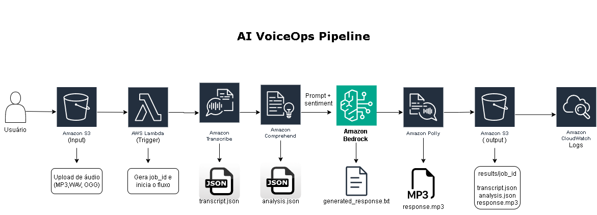
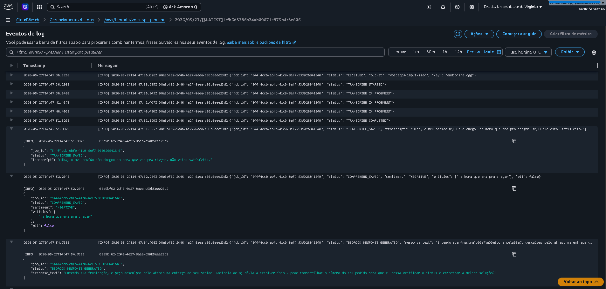

# AI VoiceOps Pipeline

Este projeto foi desenvolvido durante meus estudos para a certificação AWS AI Practitioner na Escola da Nuvem. A ideia surgiu ao combinar três laboratórios práticos sobre três serviços diferentes ( Amazon Transcribe, Comprehend e Polly ) em uma única pipeline real, evoluído
posteriormente com a adição do Amazon Bedrock para geração de respostas inteligentes.

Em vez de usar cada serviço isoladamente, projetei uma arquitetura serverless orientada a eventos que encadeia os serviços automaticamente: o áudio entra, uma resposta em voz, personalizada e inteligente sai.

---

## Visão Geral

Pipeline serverless que ouve um áudio de cliente, entende o que foi dito, detecta se a pessoa está satisfeita ou insatisfeita, gera uma resposta personalizada com IA generativa e responde automaticamente com voz sintetizada, tudo em menos de 20 segundos, sem nenhum operador humano.

## Caso de uso:
Central de atendimento inteligente: o cliente envia um áudio, o sistema processa do início ao fim e responde com voz sintetizada, sem operador humano.

---
## Performance

| Métrica | Resultado |
|--------|-----------|
| Tempo total de execução | < 20 segundos |
| Custo estimado por execução | < $0.01 |
| Arquivos gerados por execução | 3 (transcript.json, analysis.json, response.mp3) |
| Idioma suportado | Português brasileiro (pt-BR) |
| Formatos de áudio aceitos | MP3, WAV, OGG, FLAC, M4A |
| Engine de voz | Neural (Amazon Polly - Camila) |
| Modelo de linguagem | Claude Haiku (Amazon Bedrock) |

---

## Arquitetura




---

## Stack

- Amazon S3
- AWS Lambda
- AWS IAM
- Amazon CloudWatch
- Amazon Transcribe — speech-to-text com diarização
- Amazon Comprehend — NLP: sentimento, entidades, frases-chave, PII
- Amazon Polly — text-to-speech Neural engine, voz Camila (pt-BR)
- Amazon Bedrock — geração de resposta personalizada com Claude Haiku
- Python 
- GitHub Actions


---

## Fluxo Técnico

1. **Upload** — arquivo de áudio (MP3, WAV, OGG) enviado para o bucket `voiceops-input`
2. **Trigger** — evento `ObjectCreated` aciona a Lambda automaticamente
3. **job_id** — UUID gerado para rastrear todos os arquivos da execução
4. **Transcribe** — job iniciado via boto3 com diarização ativada, polling a cada 5s até conclusão
5. **Comprehend** — texto analisado: sentimento, entidades, frases-chave e detecção de PII
6. **Bedrock** — Claude Haiku gera uma resposta personalizada baseada no texto real do cliente e no sentimento detectado
7. **Polly** — resposta sintetizada em MP3 com engine Neural e voz Camila (pt-BR)
8. **Output** — três arquivos salvos no S3 sob `results/{job_id}/`
9. **Deploy** — atualização do código da Lambda automatizada via GitHub Actions ao fazer push na `main`

---

## Output por Execução

Cada execução gera uma pasta isolada no S3:

```
results/{job_id}/
├── transcript.json   — texto transcrito
├── analysis.json     — sentimento, entidades, frases-chave, PII
└── response.mp3      — resposta personalizada em voz gerada pelo Polly
```

---

## Lógica de Resposta

O Amazon Bedrock (Claude Haiku) recebe o texto transcrito e o sentimento detectado
e gera uma resposta empática e personalizada baseada no que o cliente disse de verdade.

**Exemplo real:**

| | Conteúdo |
|---|---|
| **Áudio do cliente** | "Olha, o meu pedido não chegou na hora que era pra chegar. Não estou satisfeita." |
| **Sentimento detectado** | NEGATIVE (99.9% de confiança) |
| **Resposta gerada pelo Bedrock** | Resposta empática e personalizada baseada no contexto real |
| **Resposta em voz** | MP3 sintetizado pela Camila (Polly Neural) |

---
## Evidências




---

## Execução

1. Crie os três buckets S3: `voiceops-input`, `voiceops-transcripts`, `voiceops-output`
2. Crie a IAM role `voiceops-lambda-role` com permissões para S3, Transcribe, Comprehend, Bedrock, Polly e CloudWatch
3. Crie a função Lambda com runtime Python 3.12 e associe a role
4. Configure o trigger S3 `ObjectCreated` no bucket de input
5. Configure as environment variables na Lambda: `TRANSCRIPTS_BUCKET` e `OUTPUT_BUCKET`
6. Faça upload de um arquivo de áudio no bucket de input
7. Acompanhe os logs no CloudWatch e o resultado no bucket de output

---
## CI/CD

O projeto conta com um workflow no GitHub Actions que automatiza o deploy da função Lambda.

### Como funciona

Ao fazer push na branch `main`, o workflow executa automaticamente:

1. Baixa o código do repositório
2. Autentica na AWS usando credenciais armazenadas como secrets
3. Empacota `lambda_function.py` e `bedrock.py` em `.zip`
4. Atualiza o código da função `voiceops-pipeline` via AWS CLI

### Configuração necessária

Adicione os seguintes secrets em **Settings → Secrets and variables → Actions**:

| Secret | Descrição |
|--------|-----------|
| `AWS_ACCESS_KEY_ID` | Chave de acesso da IAM user |
| `AWS_SECRET_ACCESS_KEY` | Chave secreta da IAM user |

> **Nota:** a infraestrutura (buckets S3, IAM role, trigger) precisa estar criada
> previamente na conta AWS. O workflow atualiza apenas o código da função Lambda.

---


## Melhorias Futuras

- [ ] API Gateway para receber áudio via HTTP
- [ ] Amazon SQS + DLQ para resiliência do pipeline
- [ ] Dashboard no CloudWatch para monitoramento em tempo real
- [ ] Terraform para infraestrutura como código
- [ ] Suporte a múltiplos idiomas
