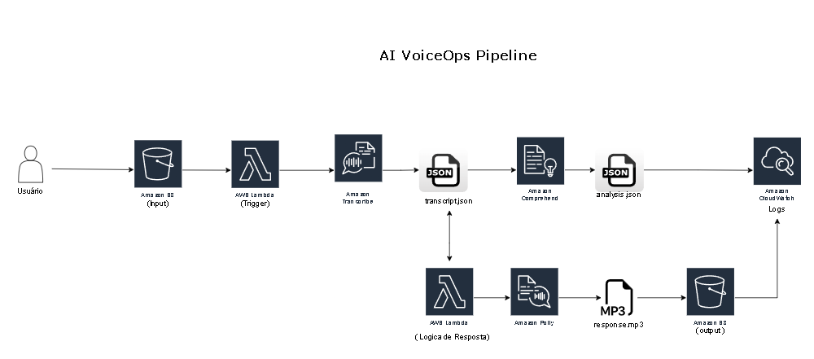
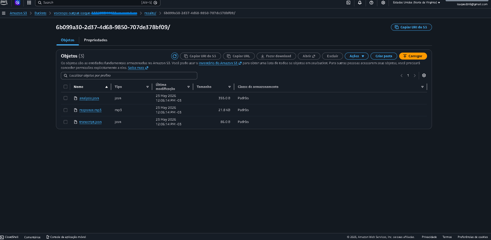
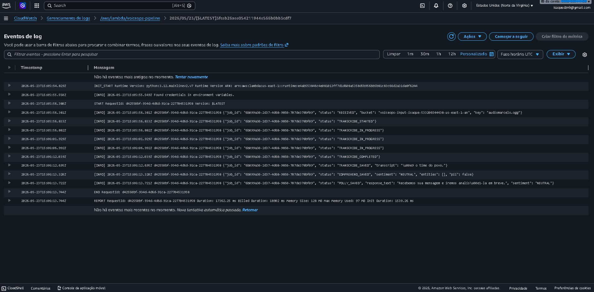

# AI VoiceOps Pipeline

Este projeto foi desenvolvido durante meus estudos para a certificação AWS AI Practitioner na Escola da Nuvem. A ideia surgiu ao combinar três laboratórios práticos sobre três serviços diferentes ( Amazon Transcribe, Comprehend e Polly ) em uma única pipeline real

Em vez de usar cada serviço isoladamente, projetei uma arquitetura serverless orientada a eventos que encadeia os três automaticamente: o áudio entra, uma resposta em voz inteligente sai

---

## Visão Geral

> Pipeline serverless que ouve um áudio de cliente, entende o que foi dito,
> detecta se a pessoa está satisfeita ou insatisfeita, e responde automaticamente
> com uma voz sintetizada — tudo em menos de 20 segundos, sem nenhum operador humano.

Pipeline serverless na AWS que recebe um arquivo de áudio, transcreve para texto,
analisa sentimento, entidades e PII com NLP, e retorna uma resposta automática em voz.

**Caso de uso:**
central de atendimento inteligente: o cliente envia um áudio, o sistema processa
do início ao fim e responde com voz sintetizada, sem operador humano.
---

## Arquitetura




---

## Stack

- Amazon S3
- AWS Lambda
- AWS IAM
- Amazon CloudWatch
- Amazon Transcribe — speech-to-text com diarização
- Amazon Comprehend — NLP: sentimento, entidades, frases-chave, PII
- Amazon Polly — text-to-speech Neural engine, voz Camila (pt-BR)
- Python 


---

## Fluxo Técnico

1. **Upload** — arquivo de áudio (MP3, WAV, OGG) enviado para o bucket `voiceops-input`
2. **Trigger** — evento `ObjectCreated` aciona a Lambda automaticamente
3. **job_id** — UUID gerado para rastrear todos os arquivos da execução
4. **Transcribe** — job iniciado via boto3, polling a cada 5s até conclusão
5. **Comprehend** — texto analisado: sentimento, entidades, frases-chave e PII
6. **Polly** — resposta selecionada pelo sentimento, sintetizada em MP3 com engine Neural
7. **Output** — três arquivos salvos no S3 sob `results/{job_id}/`

---

## Output por Execução

Cada execução gera uma pasta isolada no S3:

```
results/{job_id}/
├── transcript.json   — texto transcrito
├── analysis.json     — sentimento, entidades, frases-chave, PII
└── response.mp3      — resposta em voz gerada pelo Polly
```

---

## Lógica de Resposta

| Sentimento | Resposta automática |
|------------|-------------------|
| NEGATIVE | "Detectamos um problema e iremos priorizar seu atendimento." |
| POSITIVE | "Obrigado pelo seu feedback positivo! Ficamos felizes em ajudar." |
| NEUTRAL  | "Recebemos sua mensagem e iremos analisá-la em breve." |
| MIXED    | "Agradecemos seu contato. Nossa equipe irá avaliar sua solicitação." |

---
##




---

## Execução

1. Crie os três buckets S3: `voiceops-input`, `voiceops-transcripts`, `voiceops-output`
2. Crie a IAM role `voiceops-lambda-role` com permissões para S3, Transcribe, Comprehend, Polly e CloudWatch
3. Crie a função Lambda com runtime Python 3.12 e associe a role
4. Configure o trigger S3 `ObjectCreated` no bucket de input
5. Faça upload de um arquivo de áudio no bucket de input
6. Acompanhe os logs no CloudWatch e o resultado no bucket de output

---

## Melhorias Futuras
- [ ] GitHub Actions para deploy automático da Lambda
- [ ] API Gateway para receber áudio via HTTP
- [ ] Amazon Bedrock para resumo automático da transcrição
- [ ] Amazon SQS + DLQ para resiliência do pipeline
- [ ] Dashboard no CloudWatch para monitoramento em tempo real
- [ ] Terraform para infraestrutura como código
- [ ] Suporte a múltiplos idiomas
